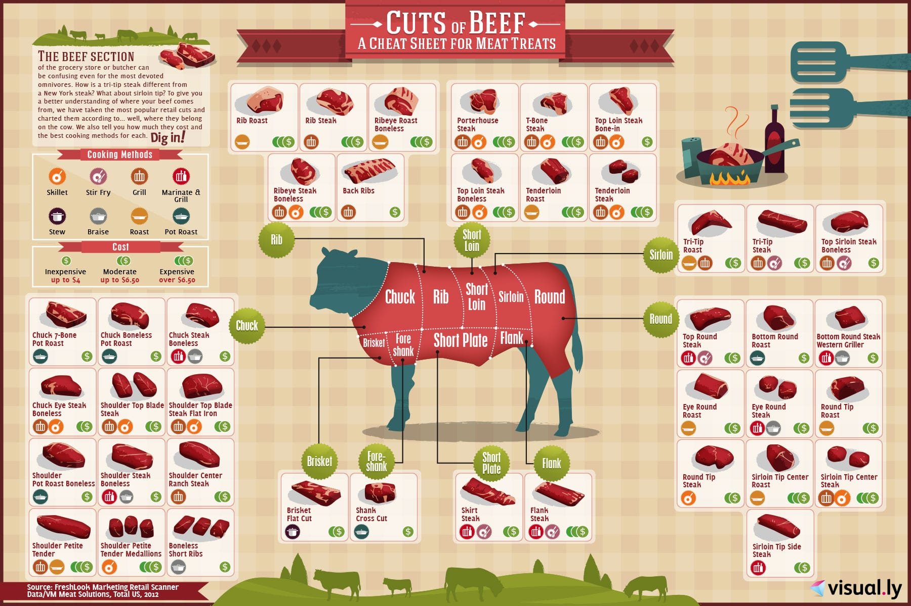
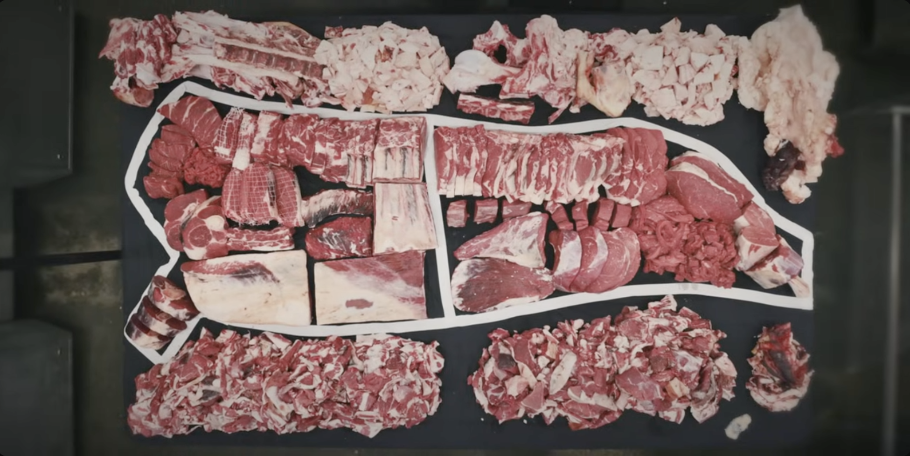

Inspired by my visit and initial meetings with the Penn State Food Lab to investigate ways to use AR & VR headsets to facilitate vocational training, this prototype of teaching the different types of beef cuts using Game-Based Learning is in early development.

- **Beef Cuts Chart**:  

- **Video guide**:  

The game mechanics are yet to be defined but will borrow from learing apps for anatomy and geography.

- **Title Screen**:  

- **Game Screen**:  

